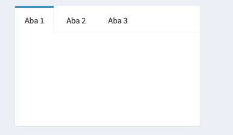
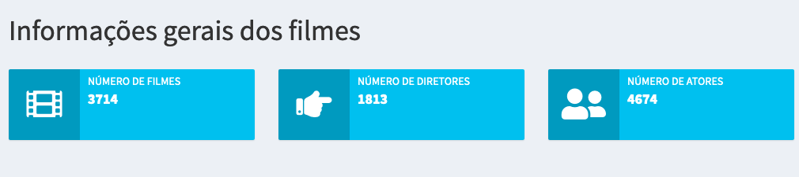

```{r, child="00-preamble.Rmd"}

```

## Shinydashboard

O `shinydasboard` é um pacote de R que introduz diversas ferramentas para o Shiny. A mais importante delas é uma nova opção de layout: o dashboard. Com um simples template, conseguimos gerar uma UI naturalmente bonita e organizada.

.pull-left[

```{r, eval=FALSE}
ui <- dashboardPage(
  dashboardHeader(),
  dashboardSidebar(),
  dashboardBody()
)
```

]

.pull-right[


]

---
## Elementos do shinydashboard

.pull-left[
- A função `dashboardPage()` é responsável por criar o layout de dashboard. Ela recebe três funções como argumentos: `dashboardHeader()`, `dashboardSidebar()` e `dashboardBody()`.

- A função `dashboardHeader()` é responsável por elementos da barra superior (azul).
]

.pull-right[


]

- A função `dashboardSidebar()` é responsável por elementos da barra lateral (preta). Geralmente colocamos nelas um menu para criar várias páginas no nosso dashboard.

- A função `dashboardBody()` controla os elementos da área principal do dashboard (cinza). É nela que colocaremos as nossas visualizações.

---
## Atividade

Vamos construir um app com o layout do Shinydashboard.

<br>

<center>

<br>
<br>
`r blue('Ao RStudio: 14-shinydashboard-layout.R')`
<center>

---
## Menu lateral

Para construir um menu na barra lateral, utilizamos a função `sidebarMenu()` dentro da função `dashboardSidebar()`. Cada item do menu é criado pela função `menuItem()`. Além do nome dado ao menu, essa função recebe um argumento chamado `tabName`, que será utilizado para nos referirmos a esse item dentro do `dashboardBody`.

```{r, eval=FALSE}
# ui
dashboardSidebar(
  sidebarMenu(
    menuItem("Item 1", tabName = "item1"),
    menuItem("Item 2", tabName = "item2")
  )
)
```

---
<br><br>

Dentro do `dashboardBody()` usamos a função `tabItems()` para listar os itens do menu. A página é criada utilizando a função `tabItem()`. Também passamos a essa função o argumento `tabName`, para podermos nos referir a cada um dos itens criados no `sidebarMenu()`. No código abaixo, substituiríamos o `...` pelos inputs e outputs que quisermos construir em cada item (página) do dashboard.

```{r, eval=FALSE}
# ui
dashboardBody(
  tabItems(
    tabItem(tabName = "item1",...),
    tabItem(tabName = "item2",...)
  )
)
```

---
<br><br>

Assim, o código da ui ficaria:

```{r, eval=FALSE}
ui <- dashboardPage(
  dashboardHeader(),
  dashboardSidebar(
    sidebarMenu(
      menuItem("Item 1", tabName = "item1"), #<<
      menuItem("Item 2", tabName = "item2")
    )
  ),
  dashboardBody(
    tabItems(
      tabItem(tabName = "item1",...), #<<
      tabItem(tabName = "item2",...)
    )
  )
)
```

---
## Atividade

Vamos construir um menu lateral no nosso Shinydashboard.

<br>

<center>

<br>
<br>
`r blue('Ao RStudio: 15-shinydashboard-menu.R')`
<center>

---
## box e tabbox

Além do layout de dashboard, o pacote `flexdashboard` trás novos elementos para a UI: o `box()` e o `tabBox()`.

.pull-left[
```{r, eval=FALSE}
box(
  title = "Histograma", ...
),
box(
  title = "Inputs", ...
)
```


]

.pull-right[

```{r, eval=FALSE}
tabBox(
  tabPanel("Aba 1",...),
  tabPanel("Aba 2",...),
  tabPanel("Aba 3",...)
)
```




]

---
## valueBox e infoBox

E novos outputs: 

.pull-left[

### valueBox


**`renderValueBox({}) + valueBoxOutput()`**

]

.pull-right[


### infoBox



**`renderInfoBox({}) + infoBoxOutput()`**

]

---
## Atividade

Vamos acrescentar esses novos elementos ao nosso Shinydashboard.

<br>

<center>

<br>
<br>
`r blue('Ao RStudio: 16-shinydashboard-elementos.R')`
<center>

---
## Referências e material extra

- [Mais sobre layout](https://shiny.rstudio.com/articles/#user-interface)

- [Tutorial do Shinydashboard](https://rstudio.github.io/shinydashboard/get_started.html)
